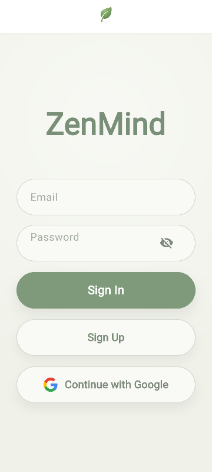
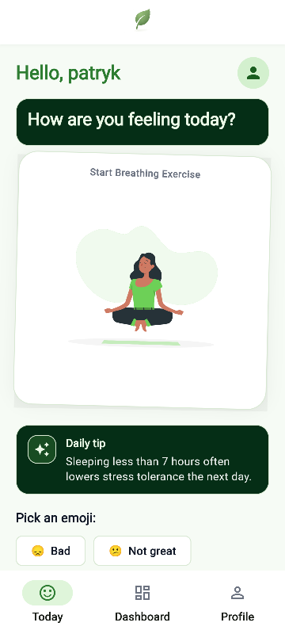
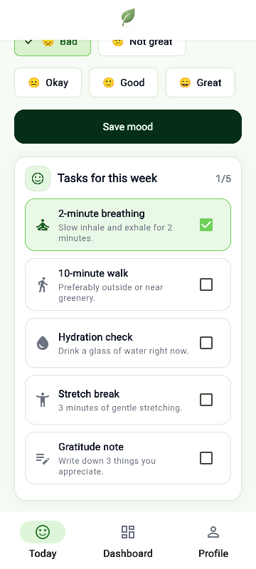
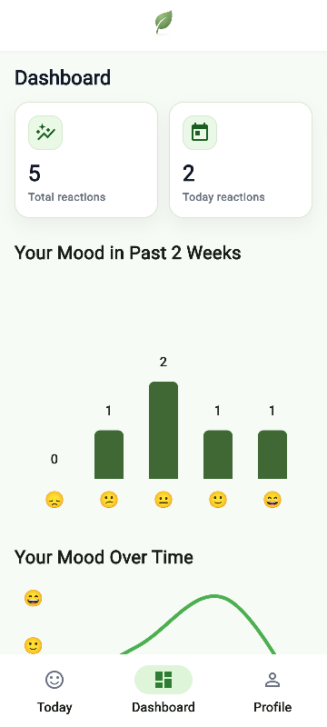
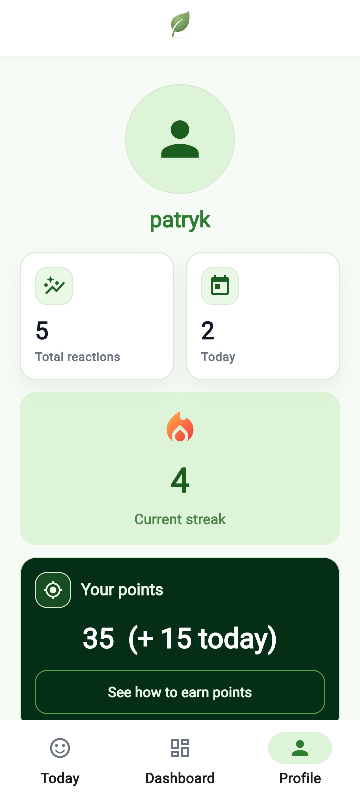

# ZenMind

BIP Mobile Programming 2026 Project - Public Copy
Mindfulness app with mood tracking, daily tips and tasks and a points system.

## Setup

### Firebase Configuration

1. Create Project in Firebase Console
2. Create a Cloud Firestore database and add a collection named `users`.
3. Create needed indexes:
   - **Manually in Firebase Console:**
     - Collection ID: `pointsHistory`
     - Fields: `reason` (Ascending), `createdAt` (Ascending)
   - **Or via CLI:**
     ```sh
     firebase deploy --only firestore:indexes
     ```

4. Enable the following providers in the Firebase Authentication section:
   - Google
   - Email/Password

### Flutter Connection

1. Connect Firebase to Flutter application.
2. Add SHA fingerprints for the Android app in the Firebase console settings.

#### Generating SHA Fingerprints

Run the command in terminal to retrieve SHA fingerprints:

```bash
keytool -list -v -keystore ~/.android/debug.keystore -alias androiddebugkey -storepass android -keypass android
```

## Screenshots

**Login:**



**Homepage:**




**Dashboard:**



**Profile:**


